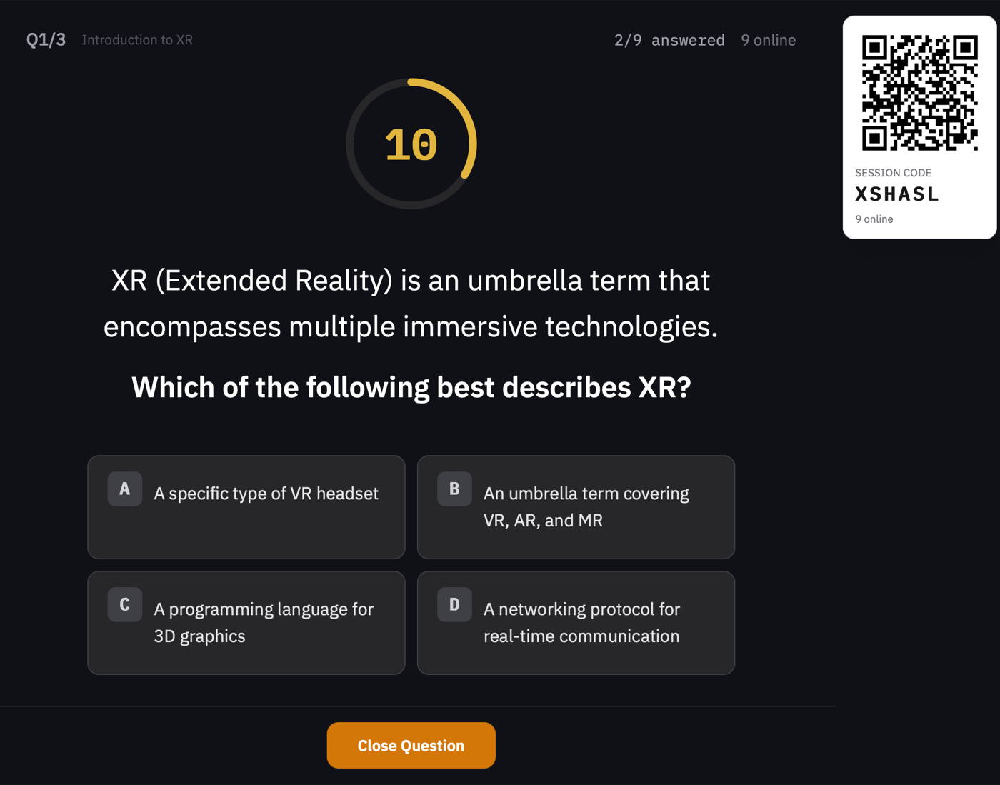
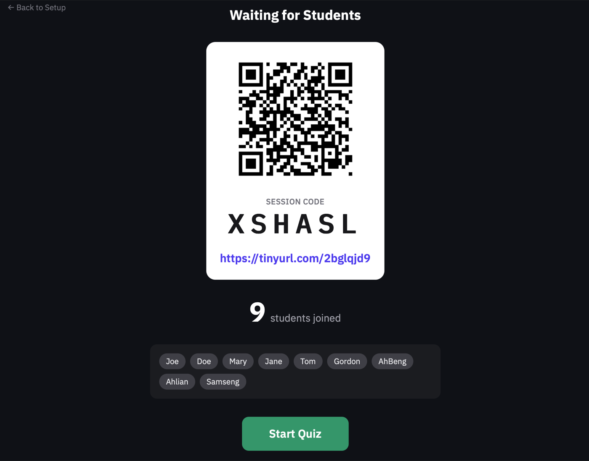
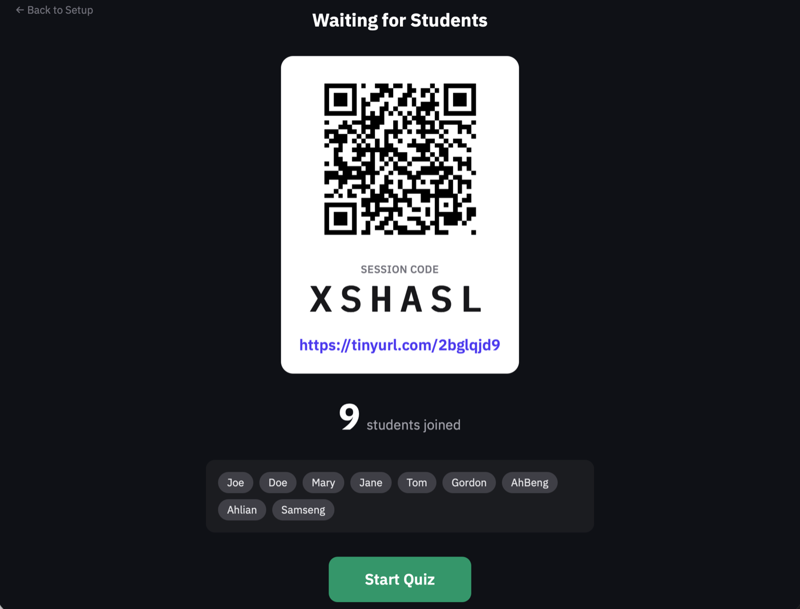
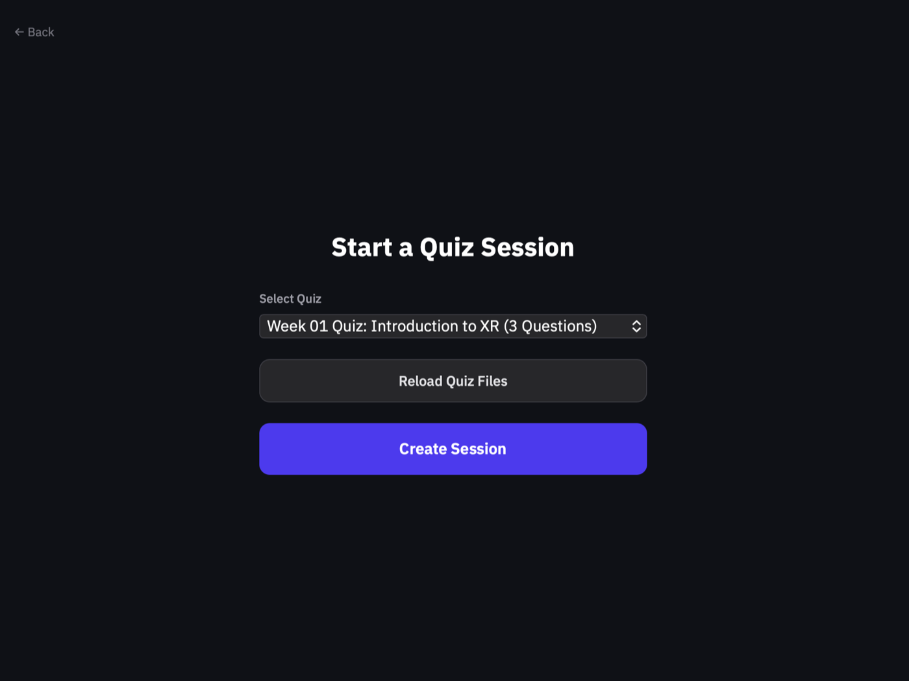

# mdq

MCQs are passe. Enter MDQs. Human- and agent-friendly Markdown Quizzes.

No clunky interfaces. No proprietary nonsense. No database.

Just your own machine and a public secure tunnel (like Tailscale).

## Disclaimer

MDQ is provided as-is, and you use it at your own risk.

MDQ is an independent project and is not affiliated with, endorsed by, or sponsored by Tailscale or TinyURL.

## Open Source Repo Layout

- `packages/`: app code (safe to commit)
- `samples/quizzes/`: tracked sample quiz markdown for onboarding
- `data/`: local-only runtime and private instance data (gitignored)
  - `data/quizzes/`: your editable quiz source files
  - `data/images/`: quiz image attachments referenced from markdown
  - `data/sessions/`, `data/submissions/`, `data/winners/`, `data/access/`: generated runtime data
  - `data/access/current.json` may contain your active Tailscale or LAN access URL and should stay local
- `docs/DEV-*.md`: local development planning docs (gitignored by naming convention)

The `data/` folder is intentionally ignored so local state and access info do not get committed.

## Static Demo Gallery

For open-source preview, the repo includes 7 curated UI screenshots under `docs/demo/`.

Selection rule (deterministic): newest 7 files in `~/Library/Mobile Documents/com~apple~CloudDocs/Downloads` matching `Screenshot 2026-03-05 at 6.*PM.png` (excluding the 8th oldest candidate).

- `Screenshot 2026-03-05 at 6.06.57 PM.png` -> `docs/demo/mdq-demo-01.png`
- `Screenshot 2026-03-05 at 6.06.39 PM.png` -> `docs/demo/mdq-demo-02.png`
- `Screenshot 2026-03-05 at 6.05.51 PM.png` -> `docs/demo/mdq-demo-03.png`
- `Screenshot 2026-03-05 at 6.05.32 PM.png` -> `docs/demo/mdq-demo-04.png`
- `Screenshot 2026-03-05 at 6.05.10 PM.png` -> `docs/demo/mdq-demo-05.png`
- `Screenshot 2026-03-05 at 6.04.51 PM.png` -> `docs/demo/mdq-demo-06.png`
- `Screenshot 2026-03-05 at 6.01.57 PM.png` -> `docs/demo/mdq-demo-07.png`

Images are resized to max dimension 1400px for a lighter repo footprint.







## First-Time Setup

```bash
cd ~/repos/mdq
npm install
npm run setup:local
```

This creates local `data/` directories, including `data/images/`, and copies sample quizzes into `data/quizzes/`.

Optional local runtime settings live in `data/config.json` (copy from `data/config.example.json`). The tracked example now includes `theme`, which defaults to `dark` and also accepts `light`.

## Tailscale Funnel Setup

mdq works best when the instructor machine is reachable through Tailscale Funnel.

If you are starting from scratch with your own personal Tailscale account, do this:

1. Go to `https://tailscale.com/` and create an account.
2. Install Tailscale on the computer that will run mdq.
3. Sign in to Tailscale on that computer.
4. Turn Tailscale on:

```bash
tailscale up
```

5. Check that Tailscale is working and note your `*.ts.net` device name:

```bash
tailscale status
```

6. Start mdq.
7. In a second terminal, publish the same port with Funnel:

```bash
tailscale funnel 3000
```

8. Copy the public URL from Tailscale and use that in mdq.
9. Share the mdq join URL, TinyURL, or QR code with students.

Common gotchas:

- If `tailscale status` does not show your device, finish signing in first.
- If `tailscale funnel 3000` fails, Funnel is usually not enabled yet for your account or device in the Tailscale admin page.
- If mdq starts on a port other than `3000`, run Funnel on that actual port instead.
- When class ends, stop mdq and stop the Funnel exposure.

## Run

### 1) Instructor setup (server machine)

```bash
# required if you want instructor-only controls
export INSTRUCTOR_PASSWORD="choose-a-strong-local-secret"

# optional: override instructor hash route (build-time)
# use a long cryptic segment for class use
export VITE_INSTRUCTOR_ROUTE_SEGMENT="instructor"

npm run start --workspace=@mdq/server
```

Open `http://localhost:3000/#/<instructor-route-segment>`.

If `VITE_INSTRUCTOR_ROUTE_SEGMENT` is unset, the default segment is `instructor` (backward compatible local dev behavior).

### 2) iPad instructor flow (private)

**Security model:** mdq serves one built client bundle to everyone (students and instructor). `VITE_INSTRUCTOR_ROUTE_SEGMENT` is build-time routing only. Real instructor access is gated by a server-side login cookie created after entering `INSTRUCTOR_PASSWORD`. The password is never bundled into client code.

1. Build the client with route segment:
   ```bash
   export VITE_INSTRUCTOR_ROUTE_SEGMENT="instructor-9f2c7b1e4d8a6f3c"
   npm run build --workspace=@mdq/client
   ```

2. On your iPad, open:

   `https://<your-mdq-host>/#/<VITE_INSTRUCTOR_ROUTE_SEGMENT>`

   Example:

   `https://abc123.ts.net/#/instructor-9f2c7b1e4d8a6f3c`

3. Enter the instructor password on the login page. Login persists for the current browser session (refresh-safe) until the browser session ends.

4. **Important limitation:** The longer route is still obscurity, not authentication by itself. Keep using a strong `INSTRUCTOR_PASSWORD` and avoid sharing your instructor route.

Tip for classroom privacy and mobility: present from iPad, add MDQ to your iPad Home Screen, and launch it as a web app. This keeps browser chrome out of view, hides the full URL during projection, and lets you walk around while controlling the session.

**For classroom security:** Keep your Tailscale Funnel URL private. The security boundary is your private network (Tailscale) plus operational secrecy (don't share the instructor route with students).

### 3) student join flow (share this one)

- Share only the student join URL or QR code from the instructor screen.
- Student QR codes resolve to `/#/join/<SESSION_CODE>` and do not need instructor login.
- Student join flow does not depend on `VITE_INSTRUCTOR_ROUTE_SEGMENT`.

Port fallback retries default to 10 attempts (`PORT_FALLBACKS=10`).

For off-LAN access during class, expose your local server with Tailscale Funnel (or an equivalent secure tunnel):

```bash
tailscale funnel 3000
```

Then share the generated `https://<machine>.ts.net` URL (or short URL / QR shown in the instructor screen).

If students see `Session not found for that code`, verify your Tailscale Funnel is bound to the same port your active mdq server process is using.

Why Tailscale works (plain language):

- Tailscale creates a secure, encrypted path between your class devices and your mdq server.
- For normal Tailscale access, each device must be signed in and approved first.
- With Funnel, anyone who has the URL can reach that one published quiz page.
- When you run `tailscale funnel 3000`, you are publishing only the mdq web app on that one port.
- This is not the same as opening your whole computer. It does not expose your files, terminal, or other apps unless you explicitly publish those too.
- If the link is shared outside class, outsiders could still reach the quiz page, so keep session links short-lived and private.

Student QR behavior:

- QR codes resolve directly to `/#/join/<SESSION_CODE>`
- students land on the join page with the code pre-filled
- instructor controls require a valid login session when `INSTRUCTOR_PASSWORD` is configured

## Quiz Markdown Format

Each question supports the existing `time_limit:` metadata plus an optional `multi_select:` flag. Question stems and option text can also include standard markdown images.

```markdown
---

## Example Topic: Selection Modes

time_limit: 45
multi_select: true

**Which items belong in the release checklist?**

A. Run verification
B. Delete git history
C. Write a short rollout note

> Correct Answers: A, C
> Overall Feedback: Verification plus a short note makes the release easier to trust and easier to hand off.
```

Rules:

- Omit `multi_select:` for backward compatibility. mdq will still treat `> Correct Answers: ...` as multi-select and `> Correct Answer: ...` as single-select.
- Use `multi_select: true` when you want students to be allowed to pick more than one option for that question.
- Do not combine `multi_select: false` with multiple correct answers.

Image attachments:

```markdown
## Example Topic: Image Prompt

time_limit: 35


**Which device is responsible for scene capture in this setup?**

A. The iPad
B. The headset strap
C. The HDMI adapter

> Correct Answer: A
> Overall Feedback: The iPad captures the source scan for reconstruction.
```

- Store image files in `data/images/`.
- Reference them from quiz markdown with ``.
- mdq rewrites that quiz-relative path to `/data/images/...` when rendering, so the same markdown works cleanly in the live frontend.

## Why This Works

mdq is optimized for a narrow classroom usage scenario:

- short, synchronous quiz sessions
- one instructor-led live room
- simple leaderboard and answer distribution
- markdown files as the source of truth
- zero-friction quiz updates: edit markdown in `data/quizzes/`, click `Reload Quiz Files`, and run the next session
- agent-friendly quiz iteration without export/import overhead

Because sessions are short and operationally simple, you do not need a large multi-tenant cloud quiz stack with heavy admin workflows and feature bloat.

## Architecture

```text
Instructor Browser                 Student Browsers
       |                                 |
       | REST (session control)          | Socket.IO (join/answer/reconnect)
       |                                 |
       +-------------+-------------------+
                     |
             Node.js + Express + Socket.IO (mdq server)
                     |
          +----------+-----------+
          |                      |
    Quiz source            Runtime output
  data/quizzes/*.md      data/sessions/*.json
                         data/submissions/*.json
                         data/winners/*.json
                         data/access/current.json (local only)
```

Design notes:

- markdown files are the single source of truth for quiz content
- live session state is in-memory for speed and simplicity
- completed session artifacts are persisted to local flat files
- access URL and QR generation are runtime concerns, not committed artifacts

## Media Scope

Image attachments are supported for quiz stems and option text through standard markdown syntax.

Embedded video is still out of scope for now. Keep video context in slides or a separate instructor-controlled window while mdq handles the prompt, options, explanations, and scoring.

## Security and Risk

The primary security boundary is your private network tunnel (for example, Tailscale Funnel) plus ephemeral classroom sessions.

Worst-case scenarios and realistic impact:

- **Link sharing outside class**: Someone with the join URL could submit answers, mitigated by short-lived sessions, visible participant counts, and per-session closure. Likelihood low, impact low to medium.
- **Student impersonation (same room)**: A student could type another student ID. This affects fairness, not host compromise. Token-based reconnect protection prevents easy socket hijack after first join. Likelihood low, impact medium for grading integrity.
- **DoS on a session URL**: Spam joins/submits could disrupt one session, but does not expose host secrets by design. Likelihood low in typical classroom context, impact medium for that class period.
- **Accidental data exposure from git push**: If runtime files were tracked, URLs/session data could leak. This repo structure avoids that by keeping `data/` local-only and gitignored. Likelihood low when workflow is followed, impact medium if ignored.

What is intentionally out of scope for this deployment model:

- hard identity verification and anti-cheat guarantees
- internet-scale adversarial abuse resistance
- long-term PII storage and compliance-heavy workflows

## Security Considerations for MDQ

### Input Safety

MDQ quizzes use button-based selections only, no free-text input. This minimizes risk because users can only interact in predefined ways. Injection or unexpected data is essentially impossible.

### Docker, Pros and Cons

Pros:

- Isolation: the app runs in a clean, consistent environment.
- Reproducibility: every run is identical, reducing surprises.

Cons:

- Slight complexity: you need to manage a Dockerfile and container setup.
- Overhead: minimal extra resource use, but not essential for a simple class deployment.

In summary, Docker offers structure, but may be overkill if you are running a simple Node.js quiz with controlled input. As long as you keep your app scoped, you are in good shape.

## Safe Contribution Workflow

- Commit code changes under `packages/`, `docs/`, `samples/`, scripts, and config files
- Keep personal/local files under `data/`
- Keep local planning notes in `docs/` using `DEV-*.md` names so they stay untracked
- Do not commit `.env*` or logs

You can push to `main` without exposing local runtime artifacts if you keep private files in `data/`.
