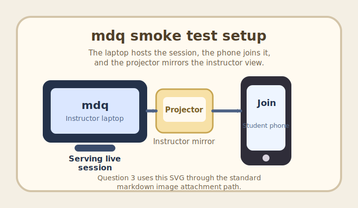

# Week 00 Quiz: Localhost Smoke Test (5 Questions)

---

## System Check: Session Basics

time_limit: 20

You are testing the quiz platform before class.

**Which screen should the instructor use to create a new live session?**

A. Student join page
B. Instructor page
C. Leaderboard page
D. Browser developer tools

> Correct Answer: B. Instructor page
> Overall Feedback: The instructor page is where you select a quiz and create a session code for students to join.

---

## System Check: Student Join

time_limit: 25
multi_select: true

A student opens the join link and enters their student ID.

**Which details should confirm the join flow is working before the first question opens?**

A. The student sees a waiting state until the instructor starts the quiz
B. The session code stays visible on the join form
C. The student is sent directly to the leaderboard
D. The student can see their student ID and optional display name were accepted

> Correct Answers: A, D
> Overall Feedback: A valid join keeps the student in the lobby until the instructor starts, and the accepted student identity should carry into the live session.

---

## System Check: Readiness Pulse

time_limit: 20
question_type: poll

The instructor wants a quick pulse check before the final smoke-test step.

**Which mdq view are you currently looking at during this test run?**

A. Instructor controls
B. Student question screen
C. Projected presentation view
D. I am between screens right now

> Overall Feedback: This poll confirms which surface each tester is validating, without changing the score.

---

## System Check: Open Response

time_limit: 25
question_type: open_response

The instructor wants to confirm that written replies are working before the final smoke-test step.

**In one sentence, describe what a student should see after submitting an open response while the question is still open.**

> Overall Feedback: After submitting, the student should see that the response was accepted, remains unscored, and can still be updated while the question is open.

---

## System Check: Image Attachment

time_limit: 25

**According to the sample setup diagram, which device is serving the live mdq session?**

A. Student phone
B. Instructor laptop
C. Classroom projector
D. Campus Wi-Fi router

> Correct Answer: B. Instructor laptop
> Overall Feedback: The diagram shows the instructor laptop hosting mdq, while the phone joins as a student client and the projector mirrors the instructor screen.

---
